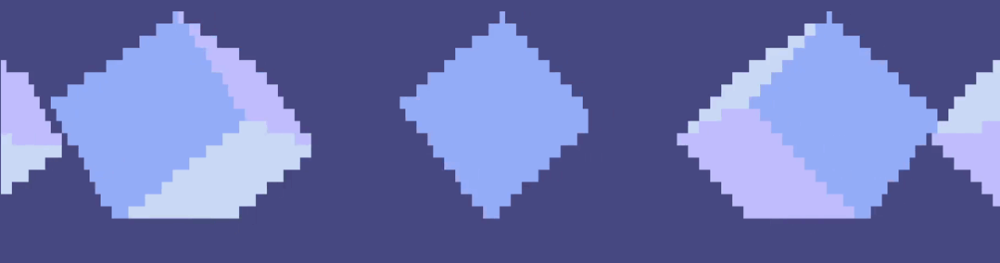

# ckube
**_raymarch cubes on your unix terminal_**

### usage
you can combine different commands to accomplish very different results. here is a list of the currently available commands, the argument they expect, what they do, and their default value in case they're not set:
flag | argument data type | what it does | default value
-----|--------------------|--------------|--------------
-r | no argument required | set some of the values randomly in a way that the scene ends up looking nice | not set by default

### why
like most of my work, i just thought about how cool it would be and i started working on it
