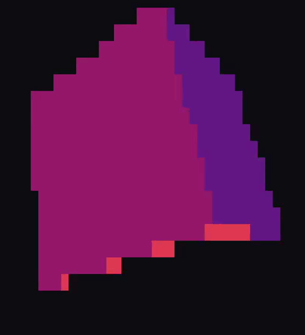
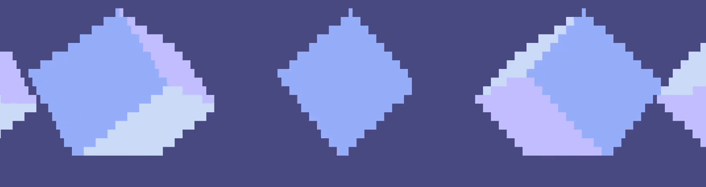

# ckube
**_raymarch cubes on your unix terminal_**

  
*`ckube`*


*`ckube -H 4.0 -m 0.1`*

### install
*__ncurses is required on your system. 
your terminal must support colors.__*
```
git clone https://github.com/soybin/ckube
cd ckube
make install
```

### usage
you can combine different commands to accomplish very different results. here is a list of the currently available commands, the argument they expect, what they do, and their default value in case they're not set:
flag | argument data type | what it does | default value
-----|--------------------|--------------|--------------
-r | no argument required | set some of the values randomly in a way that the scene ends up looking nice | not set
-c | integer | color palette change (0 - 4) 4th palette is monochrome | 0
-1 | integer | set first rendering character to any unicode character | 9608 (█)
-2 | integer | set second rendering character to any unicode character | 9608 (█)
-3 | integer | set third rendering character to any unicode character | 9608 (█)
-h | no argument required | print help | not set
-H | float | distance between every cube on the x-axis. note that any value other than zero will create an infinite line of cubes with the specified separation value. a minimum value of 4 is recommended, otherwise the cubes will overlap infinitely | 0.0
-V | float | distance between every cube on the y-axis. note that any value other than zero will create an infinite line of cubes with the specified separation value. a minimum value of 4 is recommended, otherwise the cubes will overlap infinitely | 0.0
-m | float | lineraly move the camera across the x-axis the specified amount of units per frame. if there's a single cube (in other words, -H is set to 0.0), the camera will lose track of the scene | 0.0
-M | float | lineraly move the camera across the y-axis the specified amount of units per frame. if there's a single cube (in other words, -V is set to 0.0), the camera will lose track of the scene | 0.0
-C | float | distance from the z-axis position of the camera, to the origin of coordinates (how far away is the camera from the scene) | 6.0
-P | int | degrees added to the pitch axis rotation per frame | random between [0, 5]
-Y | int | degrees added to the yaw axis rotation per frame | random between [0, 5]
-R | int | degrees added to the roll axis rotation per frame | random between [0, 5]
-f | int | frames per second (fps) | 20
-F | int | field of view (fov) | 40
-s | float | vertical stretch factor for the rendered image. this will depend on your terminal cursor aspect ratio | 2.0
-S | int | maximum amount of steps allowed when raymarching a pixel. adjusting this value will considerably affect performance | 32
-D | float | intersection distance for a ray to count as an intersection | 1e-3

*note that you may set the '-r' flag, and then overwrite any randomly set value as you want*

### why
like most of my work, i just thought about how cool it would be and i started working on it
